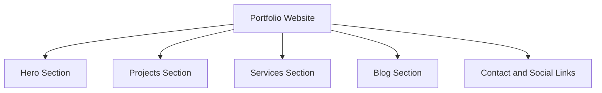

# K Rajtilak's Portfolio Website 🌟

[](https://krajtilak.vercel.app)

Welcome to the GitHub repository for my personal portfolio website. This repository contains the source code and project structure for my portfolio, which showcases my skills, projects, services, and blog.

## Table of Contents 📚
- Overview
- Features
- Technology Stack
- Project Structure
- Deployment
- Development Guide
- System Architecture
- Contributing
- License

## Overview 🌐
This portfolio website serves as a professional and interactive platform to present my:
- Personal Introduction ✍️
- Projects and Skills 🚀
- Blog Posts 📝
- Services Offered 💼

The website uses modern web development practices and a responsive design to ensure compatibility across devices.

## Features ✨
- **Dynamic Hero Section:** An animated introduction with a typed effect showcasing my roles (Developer, Freelancer, Designer).
- **Responsive Design:** Fully optimized for desktops, tablets, and mobile devices.
- **Project Showcase:** Dedicated section displaying featured projects with descriptions and links.
- **Services Section:** Highlights the technical services I provide.
- **Blog Integration:** A blog platform for sharing articles and insights.
- **Social Links:** Integrated links to GitHub, LinkedIn, Twitter, and Instagram.

## Technology Stack 🛠️
- **Frontend:**
  - HTML5: Markup structure.
  - CSS3: Styling with responsive design using Flexbox and Grid.
  - JavaScript: Interactivity and animations.
- **Hosting:**
  - Vercel: For deployment and CDN.

## Project Structure 📂
```plaintext
├── public
│   ├── images       # Static assets (profile picture, icons, etc.)
│   └── favicon.ico  # Website favicon
├── src
│   ├── components   # Reusable components (header, footer, etc.)
│   ├── pages        # Page-specific files (index, blog, contact, etc.)
│   ├── styles       # Global and component-specific CSS files
│   ├── utils        # Utility functions (animations, API calls, etc.)
│   └── assets       # Fonts, additional images
├── .vercel          # Vercel deployment configuration
├── package.json     # Project dependencies and scripts
├── README.md        # Documentation
└── index.html       # Main HTML file
```

## Deployment 🚀
The website is deployed on Vercel for seamless performance and accessibility. 

[](https://krajtilak.vercel.app)

### Steps to Deploy
1. Clone the repository.
2. Install dependencies using `npm install`.
3. Use `vercel` CLI or connect the repo to Vercel for deployment.

## Development Guide 🛠️
### Prerequisites
Ensure you have the following installed:
- Node.js (v14 or above)
- npm or yarn

### Installation
1. Clone this repository:
   ```bash
   git clone https://github.com/your-username/portfolio-website.git
   ```
2. Navigate to the project directory:
   ```bash
   cd portfolio-website
   ```
3. Install dependencies:
   ```bash
   npm install
   ```

### Running Locally 🖥️
Start the development server:
```bash
npm run dev
```
The website will be available at `http://localhost:3000`.

### Building for Production 📦
To create a production build:
```bash
npm run build
```
The optimized build will be located in the `dist` folder.

## 🔧 System Architecture




## Contributing 🤝
Contributions are welcome! Please fork this repository and create a pull request with your enhancements. 

### Guidelines
- Follow consistent code formatting.
- Add descriptive commit messages.

## License 📄
This project is licensed under the MIT License. See the [LICENSE](LICENSE) file for details.
